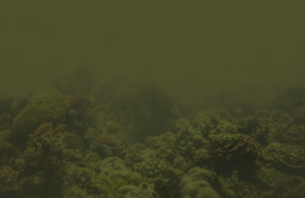

# Sea-ing Through Scattered Rays: Revisiting the Image Formation Model for Realistic Underwater Image Generation

Authors: Vasiliki Ismiroglou, Malte Pedersen, Stefan H. Bengtson, Andreas Aakerberg, Thomas B. Moeslund
### Abstract:

In recent years, the underwater image formation model has found extensive use in the generation of synthetic underwater data. Although many approaches focus on scenes primarily affected by discoloration, they often overlook the model's ability to capture the complex, distance-dependent visibility loss present in highly turbid environments. In this work, we propose an improved synthetic data generation pipeline that includes the commonly omitted forward scattering term, while also considering a nonuniform medium. Additionally, we collected the BUCKET dataset under controlled turbidity conditions to acquire real turbid footage with the corresponding reference images. Our results demonstrate qualitative improvements over the reference model, particularly under increasing turbidity, with a selection rate of 82. 5\% by survey participants. Data and code can be accessed on the project page 

Accepted in the [CVAUI & AAMVEMV](https://vap.aau.dk/marinevision/) workshop in [ICCV 2025](https://iccv.thecvf.com/) 
- Project page: https://vap.aau.dk/sea-ing-through-scattered-rays/
- Dataset:
- arXiv:

## Code usage:
```
python generate.py --config /path/to/config/file.cfg
```

The default configuration file 'configs/example.cfg' contains all configurable parameters and can be used as a template.

## Example outputs:



## Disclaimers and copyright notes
- All credit for data_tables/camspec_database.csv goes to https://www.gujinwei.org/research/camspec/db.html

- The Jerlov coefficients used in the paper were taken from [1]. As that work is not open access we provide a set of randomized water types in data_tables/randomized_water_types.csv. These have been generated following the distributions of the true Jerlov water types but potentially do not correspond to any real environments. The format of the file can be used to support any coefficient the user wishes to test.

[1] Michael G. Solonenko and Curtis D. Mobley. Inherent optical properties of Jerlov water types. Applied Optics, 54(17): 5392–5401, 2015. Publisher: Optica Publishing Group.

## Citation:
```
```